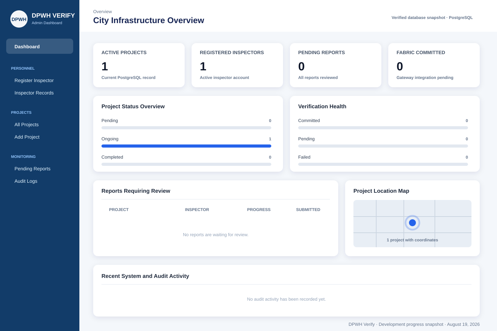

# Accomplishment Report

**Project:** Blockchain-Integrated Image Authentication and Real-Time Geotagging Framework for Enhanced Infrastructure Oversight  
**Reporting period:** August 6–19, 2026  
**Web platform:** Django with Bootstrap CSS  
**Mobile platform:** React Native

## 1. Summary

During this development period, the team established the main interfaces for
the web administrator and mobile field inspector. The Django system is now
connected to a working PostgreSQL database. Core administrator functions for
authentication, inspector registration, project management, assignment, and
dashboard monitoring are present. The database was expanded to support
inspection reports, captured-image metadata, future Hyperledger Fabric
receipts, and audit records.

The mobile team developed a functional prototype for live image capture and
geofence checking. Its current geofence coordinates and radius are hardcoded;
integration with the Django API and project database remains a succeeding
activity.

## 2. Major accomplishments

### Web Administrator — Django with Bootstrap CSS

1. Developed the web-administrator frontend using Django templates, Bootstrap,
   Bootstrap Icons, and project-specific CSS.
2. Developed the administrator login interface and restricted the primary web
   dashboard to staff or superuser accounts.
3. Enabled creation of a Django superuser for accessing the built-in Django
   administration panel and the custom DPWH dashboard.
4. Developed inspector registration and inspector-record listing. Each
   inspector has a linked Django user account, employee ID, contact details,
   district, position, and active status.
5. Developed project creation and editing, including project description,
   contractor, budget, schedule, progress, status, GPS coordinates, and
   geofence radius.
6. Developed the assignment of an inspector to a specific infrastructure
   project while retaining assignment history.
7. Replaced hardcoded dashboard numbers with live PostgreSQL queries.
8. Expanded the dashboard with:
   - Active Projects
   - Registered Inspectors
   - Pending Reports
   - Fabric Committed records
   - Project Status Overview
   - Verification Health
   - Reports Requiring Review
   - Project Location Map
   - Recent System and Audit Activity
9. Added clear empty states so the dashboard does not display invented
   verification or audit information when no records exist.
10. Added off-chain media configuration for future field-inspection image
    uploads.

### PostgreSQL database foundation

1. Confirmed that Django is connected to PostgreSQL using database
   `dpwh_verify_db`.
2. Confirmed that the verification migrations were applied successfully.
3. Preserved the existing User, Inspector, Project, ProjectAssignment, and
   VerificationReport data structures.
4. Expanded `VerificationReport`, the system's logical InspectionReport entity,
   with:
   - Progress percentage
   - Accomplishment description
   - Reviewed by
   - Reviewed at
   - Review notes
5. Added `InspectionImage` for off-chain image and verification metadata:
   - Image storage reference
   - SHA-256 hash
   - Perceptual hash
   - Latitude and longitude
   - Altitude and GPS accuracy
   - Capture timestamp
   - Geofence distance and status
   - File size and MIME type
6. Added `BlockchainRecord` for the local copy of future Hyperledger Fabric
   receipts:
   - Transaction ID
   - Block number
   - Chaincode name
   - Commit status
   - Commit timestamp
   - Metadata JSON
   - Error message
7. Added `AuditLog` for user actions, affected records, device information, IP
   address, and timestamps.
8. Registered the new tables in Django Admin for database inspection and
   demonstration.
9. Prepared a database ERD showing how users, inspectors, projects, reports,
   images, blockchain receipts, and audit events are related.

### Mobile Application — React Native

The following mobile accomplishments were reported by the mobile-development
team and were not independently verified in the Django workspace:

1. Developed a functional prototype of the live-capture interface.
2. Added prototype longitude, latitude, and geofence-radius inputs using
   hardcoded values.
3. Implemented acceptance of a submission when the captured location is inside
   the configured geofence radius.
4. Implemented rejection of a submission when the captured location is outside
   the configured geofence radius.

## 3. Current verified database status

As of August 19, 2026, the connected PostgreSQL database contains:

| Record | Current count |
|---|---:|
| Superuser accounts | 1 |
| Projects | 1 |
| Ongoing projects | 1 |
| Inspectors | 1 |
| Inspection/verification reports | 0 |
| Inspection images | 0 |
| Blockchain receipt records | 0 |
| Audit-log records | 0 |

Zero blockchain records are expected at this stage. `BlockchainRecord` prepares
the backend for Fabric receipts but does not represent a completed Hyperledger
Fabric integration.

## 4. Progress evidence

The following snapshot represents the implemented dashboard layout using the
verified PostgreSQL counts above. It is a generated progress snapshot rather
than a browser capture because automated browser access was not authorized.

The editable database ERD is available in
[database-erd.md](database-erd.md).

## 5. Verification performed

- Django system check completed without errors.
- Dashboard returned HTTP status 200 during a server-side render test.
- All requested dashboard sections were present in the rendered response.
- Verification migrations `0001` and `0002` are applied in PostgreSQL.
- Four automated schema tests passed.
- The expected inspection-image, blockchain-record, and audit-log tables are
  present in PostgreSQL.

## 6. Remaining work

1. Create the authenticated API that receives reports from React Native.
2. Replace hardcoded mobile geofence inputs with project coordinates downloaded
   from Django.
3. Recalculate SHA-256 and pHash on the backend.
4. Calculate and store geofence distance in Django.
5. Add administrator report-detail, approval, and rejection workflows.
6. Create audit records automatically when important actions occur.
7. Connect Django to a Fabric Gateway service.
8. Develop and deploy chaincode for immutable image-evidence metadata.
9. Store real Fabric transaction receipts in `BlockchainRecord`.
10. Conduct end-to-end testing from mobile capture through administrator review.

## 7. Recommended next reporting milestone

For the next progress period, demonstrate one complete inspection submission:

1. An inspector selects an assigned project in React Native.
2. The inspector captures a live image and current GPS coordinates.
3. The mobile app submits the evidence to Django.
4. Django stores the image and metadata in PostgreSQL.
5. Django calculates the geofence result and image hashes.
6. The report appears in Reports Requiring Review.
7. An administrator approves or rejects the report.
8. The action appears in the audit history.

This milestone should be completed before presenting the system as fully
integrated with Hyperledger Fabric.
