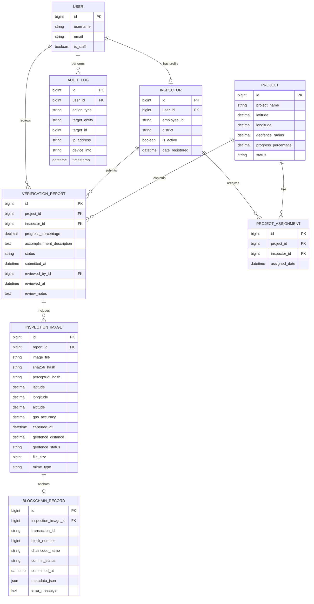

# DPWH Verify database ERD

The existing `VerificationReport` model is the implementation of the logical
`InspectionReport` entity. Its original name is retained so existing routes,
templates, migrations, and database records continue to work.

## Storage boundary

- PostgreSQL stores users, projects, reports, image metadata, audit events, and a
  local copy of each Fabric transaction receipt.
- Uploaded image files are stored off-chain under `MEDIA_ROOT` (or a future
  object-storage service).
- Hyperledger Fabric will store lightweight verification metadata. A
  `BlockchainRecord` row is a searchable local receipt; it is not the ledger.
